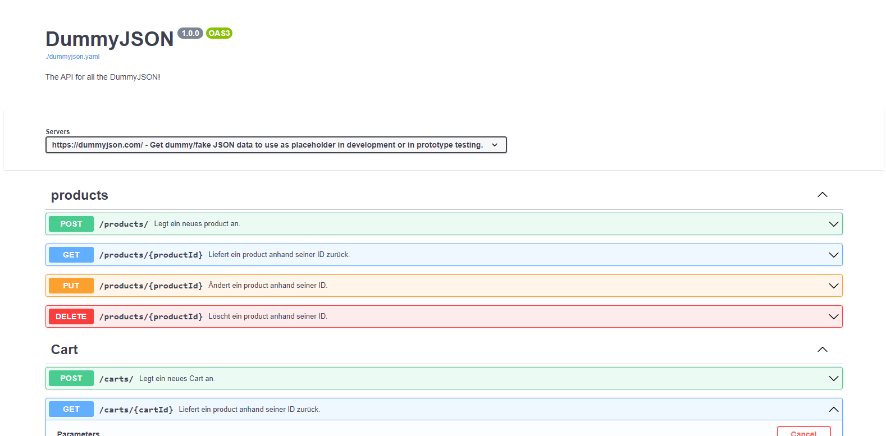

# YAML_OpenAPI_DummyJson_Products

A small example of how to use OpenAPI.
https://www.openapis.org/what-is-openapi

You can preview the
<a target='_blank' href='https://ederlmarkus.github.io/YAML_OpenAPI_DummyJson_Products/'> generated Swagger-UI here.</a>

